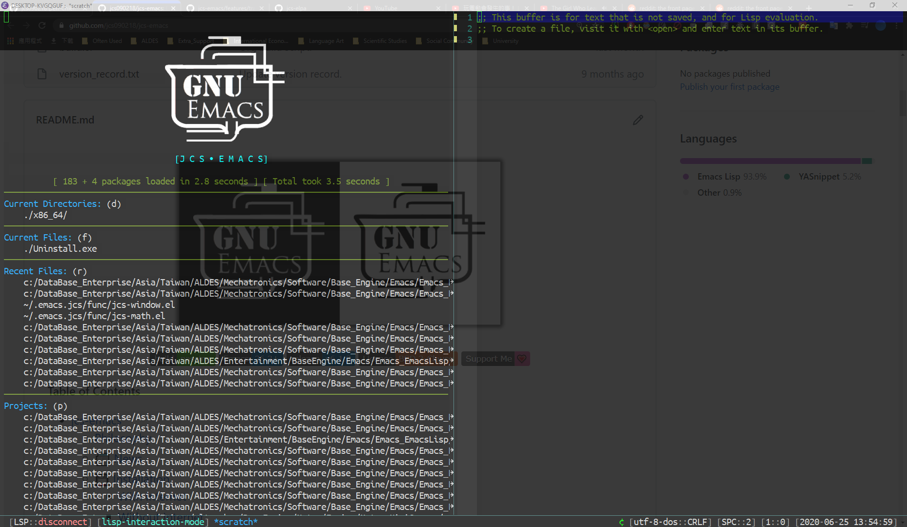

# transwin
> Make window/frame transparent.

  

## Usage

`transwin-toggle-transparent-frame`

Toggle transparent frame to the previous record alpha value.

`transwin-ask-set-transparency`

Set alpha value directly.

`transwin-increment-frame-transparent` or `transwin-decrement-frame-transparent`

Increment or decrement the current frame's alpha value.

## Contribution

If you would like to contribute to this project, you may either
clone and make pull requests to this repository. Or you can
clone the project and establish your own branch of this tool.
Any methods are welcome!
